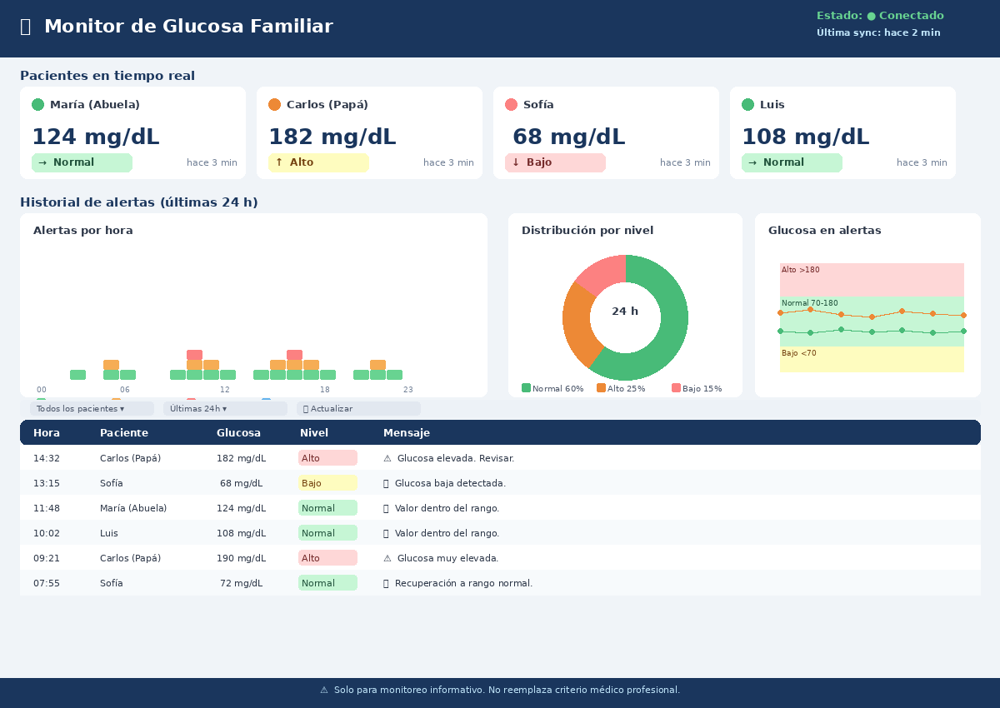

# 👨‍👩‍👦 Family Glucose Monitor


> **⚠️ AVISO MÉDICO:** Este software NO es un dispositivo médico y NO reemplaza las alarmas del sensor CGM ni la atención profesional. Consulta [DISCLAIMER.md](DISCLAIMER.md) antes de usarlo.

Monitor de glucosa familiar para **padres y cuidadores** de personas con diabetes que usan sensores **FreeStyle Libre** con la app **LibreLinkUp**. Lee automáticamente las lecturas de *todos* los pacientes vinculados a tu cuenta y envía alertas por Telegram, Webhook o WhatsApp cuando los valores salen del rango configurado.

---

## ¿Para quién es?

Para **familias** donde uno o varios miembros usan un sensor FreeStyle Libre y tienen a un cuidador (padre, madre, pareja) configurado en LibreLinkUp. Este sistema centraliza las alertas de todos los pacientes en tus canales de comunicación favoritos.

---

## ✨ Características

- 📡 Lectura multi-paciente desde LibreLinkUp (todos los pacientes de la cuenta)
- 🌍 Soporte de 12 regiones de LibreLinkUp con auto-redirect
- ⚠️ Alertas configurables por umbral bajo/alto con cooldown anti-spam
- 📈 Alertas por tendencia (subiendo rápido, bajando rápido, etc.)
- 💬 Salidas: **Telegram**, **Webhook** (Pushover-compatible), **WhatsApp Cloud API**
- 🖥️ Dashboard web autenticado con semáforo de colores y gráficos por paciente
- 🔐 Autenticación con sesiones persistentes (SQLite) y contraseñas PBKDF2
- 🔒 Credenciales de LibreLinkUp encriptadas en disco (Fernet/AES-128-CBC)
- 📊 API REST externa para widgets, Home Assistant e integraciones locales
- 📋 Historial de alertas persistente (SQLite) con limpieza automática
- 🔄 Retry automático con exponential backoff para la API de LibreLinkUp
- 🔄 Modos: **cron** (una lectura), **daemon** (bucle continuo), **dashboard** (panel web), **full** (monitoreo + dashboard)
- 🗂️ Estado persistente por paciente con escritura atómica
- ✅ Validación de configuración al inicio con mensajes claros
- 🐳 Docker-ready
- 🧪 Tests unitarios con pytest

---

## 🚀 Quick Start

### 1. Clonar e instalar

```bash
git clone https://github.com/jmsantamariar/family-glucose-monitor.git
cd family-glucose-monitor
python -m venv .venv
source .venv/bin/activate        # Windows: .venv\Scripts\activate
pip install -r requirements.txt
```

### 2. Copiar y editar la configuración

```bash
cp config.example.yaml config.yaml
chmod 600 config.yaml
```

Edita `config.yaml` con tus credenciales:

```yaml
librelinkup:
  email: "tu-email@ejemplo.com"
  password: "tu-contraseña"
  region: "EU"          # US, EU, EU2, DE, FR, JP, AP, AU, AE, CA, LA, RU

alerts:
  low_threshold: 70
  high_threshold: 180
  cooldown_minutes: 20
  max_reading_age_minutes: 15

outputs:
  - type: telegram
    enabled: true
    bot_token: "123456:ABC..."
    chat_id: "-100123456789"
```

### 3. Validar la conexión

```bash
python validate_connection.py
python validate_telegram.py   # si usas Telegram
```

### 4. Ejecutar

```bash
python -m src.main
```

---

## 🏗️ Arquitectura

```
LibreLinkUp API (Abbott)
       │
       ▼
glucose_reader.py ──── lee TODOS los pacientes (con retry + backoff)
       │
       ▼
main.py ─── run_once() ─── evalúa umbrales y tendencias
       │                         │
       ├──► outputs/telegram.py  ──► Bot de Telegram
       ├──► outputs/webhook.py   ──► HTTP POST (Pushover)
       └──► outputs/whatsapp.py  ──► WhatsApp Cloud API
       │
       ├──► readings_cache.json (fuente única de verdad)
       │         │
       │         ├──► api.py (dashboard :8080) ── lazy reload por mtime
       │         └──► api_server.py (API externa :8081) ── lectura directa
       │
       └──► alert_history.db (SQLite)
                 │
                 └──► /api/alerts (ambos servidores)

Seguridad:
  config.yaml ──► credenciales LLU encriptadas (Fernet)
  .secret_key ──► clave de encriptación (0600)
  sessions.db ──► sesiones persistentes (SQLite)
  dashboard_auth ──► contraseñas PBKDF2-HMAC-SHA256
```

Para el diagrama completo y decisiones de diseño, consulta [docs/ARCHITECTURE.md](docs/ARCHITECTURE.md).

### Modos de ejecución

| Modo | Descripción | Polling | Dashboard |
|------|-------------|---------|-----------|
| `cron` | Una sola lectura y sale | ✅ (1 vez) | ❌ |
| `daemon` | Bucle continuo con intervalo configurable | ✅ (loop) | ❌ |
| `dashboard` | Solo panel web, sin alertas | ❌ | ✅ (:8080) |
| `full` | Monitoreo completo + dashboard | ✅ (hilo daemon) | ✅ (:8080, main thread) |

En modo `full`, Uvicorn se ejecuta en el hilo principal (manejo correcto de señales) y el polling corre en un hilo daemon en segundo plano. Solo hay **un** ciclo de polling activo.

---

## 🔐 Seguridad

| Mecanismo | Descripción |
|-----------|-------------|
| **Encriptación de credenciales** | Contraseña de LibreLinkUp almacenada con Fernet (AES-128-CBC + HMAC-SHA256) en `config.yaml`. Backward compatible con texto plano. |
| **Hashing de contraseñas** | Contraseña del dashboard hasheada con PBKDF2-HMAC-SHA256 (260,000 iteraciones). |
| **Sesiones persistentes** | Tokens de sesión almacenados en SQLite (`sessions.db`) con TTL de 24 horas. |
| **Permisos de archivos** | `config.yaml` y `.secret_key` con permisos `0600` (solo propietario). |
| **CORS restringido** | API externa sin orígenes permitidos por defecto. Configurable via `CORS_ALLOWED_ORIGINS`. |
| **Separación de credenciales** | Credenciales de LibreLinkUp independientes de las del dashboard. |

> ⚠️ Para reportar vulnerabilidades, consulta [SECURITY.md](SECURITY.md).

### Estructura de archivos

```
config.yaml              ← credenciales y umbrales (nunca en git)
src/
  main.py                ← orquestador principal (modos: cron, daemon, dashboard, full)
  config_schema.py       ← validación de configuración
  glucose_reader.py      ← lee TODOS los pacientes vía pylibrelinkup
  alert_engine.py        ← evalúa umbrales, cooldown, construye mensajes
  state.py               ← persistencia JSON por patient_id
  api.py                 ← dashboard web + API interna autenticada (modo dashboard/full)
  api_server.py          ← API REST externa de solo lectura (sin auth, para widgets/apps)
  auth.py                ← gestión de sesiones y credenciales del dashboard
  alert_history.py       ← historial de alertas en SQLite
  outputs/
    base.py              ← clase abstracta BaseOutput
    telegram.py          ← Bot API de Telegram
    webhook.py           ← Webhook HTTP (Pushover-compatible)
    whatsapp.py          ← WhatsApp Cloud API
tests/
  test_alert_engine.py
  test_state.py
  test_telegram_output.py
  test_api.py
  test_api_server.py
  test_auth.py
docs/
  ARCHITECTURE.md        ← diseño del sistema
  DEPLOYMENT.md          ← guía de despliegue y operación
  PRIVACY.md             ← privacidad de datos de salud
validate_connection.py   ← prueba la conexión a LibreLinkUp
validate_telegram.py     ← prueba el bot de Telegram
```

---

## 📬 Ejemplo de alerta en Telegram

Cuando la glucosa de un paciente sale del rango, recibirás en Telegram:

```
⚠️ Mamá: glucosa en 55 mg/dL ↓ — BAJA
```

```
⚠️ Juan: glucosa en 250 mg/dL ↑ — ALTA
```

Los mensajes incluyen el nombre del paciente, el valor, la flecha de tendencia y el nivel de alerta. Puedes personalizar el formato en `config.yaml` bajo `alerts.messages`.

---

## ⚙️ Configuración completa

### Variables de entorno (recomendado para producción/Docker)

```bash
export LIBRELINKUP_EMAIL="tu-email@ejemplo.com"
export LIBRELINKUP_PASSWORD="tu-contraseña"
export WHATSAPP_ACCESS_TOKEN="token_whatsapp"  # opcional
```

### Telegram — configuración del bot

1. Habla con [@BotFather](https://t.me/BotFather) → `/newbot` → copia el token.
2. Obtén tu `chat_id`: abre `https://api.telegram.org/bot<TOKEN>/getUpdates` después de enviar un mensaje al bot.
3. Configura en `config.yaml` y valida con `python validate_telegram.py`.

### Modo daemon (bucle continuo)

```yaml
monitoring:
  mode: "daemon"
  interval_seconds: 300   # cada 5 minutos
```

---

## ▶️ Ejecución

El modo de ejecución se configura con `monitoring.mode` en `config.yaml`. Hay cuatro modos disponibles:

| Modo | Descripción | Polling LibreLinkUp | Ciclo de alertas | Dashboard |
|------|-------------|---------------------|------------------|-----------|
| `cron` | Una sola lectura y salida (default) | ✅ una vez | ✅ una vez | ❌ |
| `daemon` | Bucle continuo en foreground | ✅ continuo | ✅ continuo | ❌ |
| `dashboard` | Panel web; hace polling sin ciclo de alertas/salidas | ✅ background | ❌ | ✅ |
| `full` | Polling + ciclo de alertas + panel web | ✅ background | ✅ background | ✅ |

### Modo cron (una sola lectura)

```yaml
monitoring:
  mode: "cron"
```

```bash
python -m src.main
```

Agrega al crontab para ejecución periódica:
```
*/5 * * * * cd /ruta/proyecto && .venv/bin/python -m src.main >> /var/log/glucose.log 2>&1
```

### Modo daemon (bucle continuo)

```yaml
monitoring:
  mode: "daemon"
  interval_seconds: 300
```

```bash
python -m src.main
```

### Modo dashboard (panel web)

```yaml
monitoring:
  mode: "dashboard"

dashboard:
  host: "0.0.0.0"
  port: 8080
```

```bash
python -m src.main
# Panel disponible en http://localhost:8080
```

### Modo full (monitoreo + dashboard)

```yaml
monitoring:
  mode: "full"
  interval_seconds: 300

dashboard:
  host: "0.0.0.0"
  port: 8080
```

```bash
python -m src.main
# Dashboard en http://localhost:8080 + ciclos de monitoreo cada 5 minutos
```

### Docker

```bash
docker build -t family-glucose-monitor .
docker run --rm \
  -v $(pwd)/config.yaml:/app/config.yaml:ro \
  -v $(pwd)/state.json:/app/state.json \
  family-glucose-monitor
```

---

## 🌐 API REST externa

El sistema incluye un servidor de API ligero (`src/api_server.py`) para que clientes externos (widgets Android, complicaciones de Apple Watch, dashboards remotos) consuman las últimas lecturas de glucosa **sin autenticación**.

> **Distinción importante:** `src/api.py` es el backend del dashboard web (requiere login). `src/api_server.py` es la API externa de solo lectura (sin auth, CORS habilitado). Son dos servidores independientes con propósitos distintos.

### Cómo funciona

El proceso de monitoreo principal (`src/main.py`) escribe `readings_cache.json` al final de cada ciclo. La API externa lee ese archivo en cada petición, sin hacer llamadas directas a LibreLinkUp.

```
python -m src.main         ←→  escribe readings_cache.json
                                           ↓
uvicorn src.api_server:app ←→  lee readings_cache.json → responde clientes
```

### Habilitar la API externa

```bash
# Junto al monitor (terminal separada o proceso independiente):
uvicorn src.api_server:app --host 0.0.0.0 --port 8081
```

Con Docker:

```bash
docker run --rm \
  -v $(pwd)/config.yaml:/app/config.yaml:ro \
  -v $(pwd)/readings_cache.json:/app/readings_cache.json \
  -p 8081:8081 \
  family-glucose-monitor \
  uvicorn src.api_server:app --host 0.0.0.0 --port 8081
```

### Endpoints de la API externa

| Method | Path | Description |
|--------|------|-------------|
| `GET` | `/api/readings` | All cached patient readings |
| `GET` | `/api/readings/{patient_id}` | Single patient reading by ID |
| `GET` | `/api/health` | API health + data freshness |

#### `GET /api/readings`

```json
{
  "readings": [
    {
      "patient_id": "abc-123",
      "patient_name": "Juan García",
      "value": 120,
      "timestamp": "2026-01-01T10:00:00+00:00",
      "trend_name": "Flat",
      "trend_arrow": "→",
      "is_high": false,
      "is_low": false
    }
  ],
  "updated_at": "2026-01-01T10:05:00+00:00"
}
```

#### `GET /api/readings/{patient_id}`

Returns the reading object for the given patient ID, or `404` if not found.

#### `GET /api/health`

```json
{
  "status": "ok",
  "patient_count": 3,
  "updated_at": "2026-01-01T10:05:00+00:00",
  "cache_age_seconds": 42.5
}
```

### `config.yaml` API section

```yaml
api:
  enabled: false          # reserved for future auto-start integration
  host: "0.0.0.0"
  port: 8081
  cache_file: "readings_cache.json"
```

> **Nota:** `api.cache_file` configura la ruta donde `src/main.py` escribe el cache. Sin embargo, `src/api_server.py` lee siempre desde `readings_cache.json` en el directorio raíz del proyecto (ruta fija). Para evitar desincronización, mantén el valor por defecto o asegúrate de montar ambas rutas al mismo archivo.

Para una guía completa de despliegue incluyendo HTTPS, reverse proxy, permisos y configuración de producción, consulta [docs/DEPLOYMENT.md](docs/DEPLOYMENT.md).

---

## 🖥️ Dashboard

El sistema incluye un dashboard web en tiempo real que muestra el estado de todos los pacientes monitoreados.

### Características del Dashboard

- **Vista multi-paciente**: Tarjetas con lectura actual, tendencia y tiempo desde última lectura
- **Código de colores semáforo**: Verde (normal), Amarillo (precaución), Rojo (alerta)
- **Gráficas de alertas por hora**: Histograma apilado por paciente (últimas 24h)
- **Distribución por nivel**: Gráfica de dona mostrando proporción bajo/normal/alto
- **Valores de glucosa en alertas**: Gráfica de línea por paciente con zonas de rango
- **Filtros**: Por paciente y por período de tiempo
- **Modo oscuro**: Adaptación automática al tema del sistema
- **Auto-actualización**: Los datos se refrescan automáticamente

### Mockup del Dashboard



> **Nota**: Este mockup muestra las mejoras planificadas para el dashboard. La versión actual ya incluye la tabla de pacientes en tiempo real con código de colores.

### Ejecutar el Dashboard

```bash
# Modo solo dashboard (polling a LibreLinkUp en background, sin envío de alertas)
# En config.yaml: monitoring.mode: "dashboard"
python -m src.main

# Modo completo (polling + ciclo de alertas + dashboard en paralelo)
# En config.yaml: monitoring.mode: "full"
python -m src.main
```

El dashboard estará disponible en `http://localhost:8080` por defecto.

> **Nota de seguridad:** El dashboard requiere autenticación. El proceso de setup inicial (`/setup`) te pedirá crear credenciales. Para producción, consulta [docs/DEPLOYMENT.md](docs/DEPLOYMENT.md) para recomendaciones de HTTPS y reverse proxy.

---

## 🧪 Tests

```bash
pip install -r requirements-dev.txt
pytest tests/ -v --cov=src
```

---

## ⚠️ Limitaciones

- **No es un dispositivo médico.** No está certificado por ninguna autoridad sanitaria.
- **Depende de LibreLinkUp.** Si la API de Abbott no está disponible, no habrá lecturas.
- **No almacena histórico.** Solo persiste el estado de la última alerta por paciente.
- **No garantiza entrega en tiempo real.** Pueden ocurrir retrasos por red, API o servicios de mensajería.
- **No reemplaza las alarmas del sensor.** Las alarmas del FreeStyle Libre son el mecanismo primario.
- **API no oficial.** LibreLinkUp no provee una API pública documentada; puede cambiar sin aviso.

---

## 🔒 Seguridad y privacidad

- `config.yaml` está en `.gitignore` — **nunca** lo subas al repositorio.
- Usa `chmod 600 config.yaml` para restringir el acceso.
- Para producción, usa variables de entorno en lugar de secretos en `config.yaml`.
- **No expongas el dashboard ni la API sin HTTPS** en producción — consulta [docs/DEPLOYMENT.md](docs/DEPLOYMENT.md).
- Consulta [SECURITY.md](SECURITY.md) para la política de seguridad completa.
- Consulta [docs/PRIVACY.md](docs/PRIVACY.md) para información sobre privacidad de datos.

---

## 📦 Créditos

- [robberwick/pylibrelinkup](https://github.com/robberwick/pylibrelinkup) — cliente Python para LibreLinkUp
- [rreal/glucose-actions](https://github.com/rreal/glucose-actions) — arquitectura de alertas
- [DiaKEM/libre-link-up-api-client](https://github.com/DiaKEM/libre-link-up-api-client) — referencia de la API

---

> **⚠️ AVISO MÉDICO FINAL:** Este software NO es un dispositivo médico. NO reemplaza las alarmas del sensor CGM ni la atención profesional. El usuario asume toda la responsabilidad. Consulta [DISCLAIMER.md](DISCLAIMER.md).
