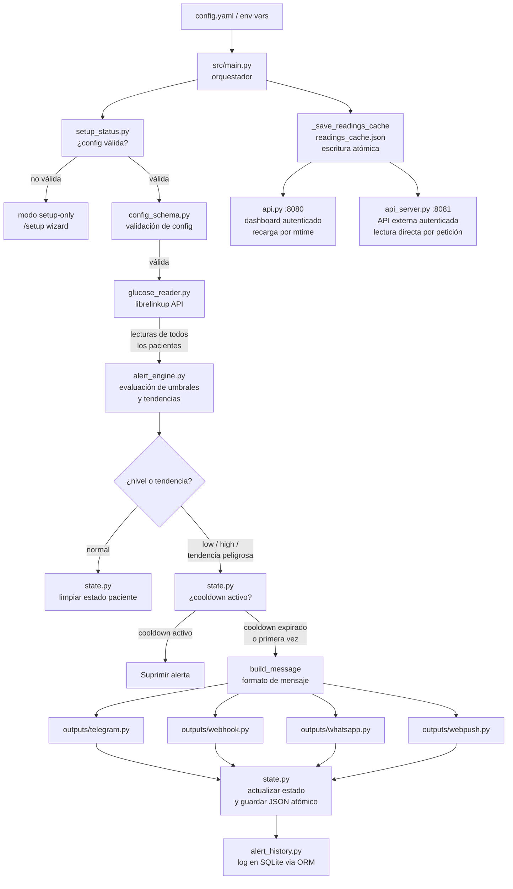

# 🏗️ Arquitectura del Sistema

## Diagrama de flujo



---

## Módulos y responsabilidades

### `src/main.py` — Orquestador principal

Punto de entrada del sistema. Responsabilidades:
- Invocar `setup_status.py` para decidir si arrancar en modo normal o en modo setup-only
- Cargar y validar `config.yaml`
- Configurar logging
- Adquirir file lock con `fcntl` (evita ejecuciones concurrentes en modos con bucle: `daemon` y `full`)
- Ejecutar en modo `cron` (una sola vez), `daemon` (bucle con intervalo), `dashboard` (solo panel web) o `full` (dashboard + bucle)
- Orquestar el ciclo completo: lectura → evaluación → estado → envío → persistencia
- Escribir `readings_cache.json` con escritura atómica al final de cada ciclo

### `src/setup_status.py` — Detección de setup completo

Determina si la aplicación tiene una configuración válida antes de arrancar. Distingue entre:
- **Setup completo:** `config.yaml` existe, es YAML válido, es un mapping no vacío y pasa la validación completa de `config_schema.py`.
- **Setup incompleto:** cualquier fallo en lo anterior → `main.py` arranca en modo setup-only (solo el dashboard en `/setup`).

Expone `check_setup(config_path) → SetupStatus` y el wrapper booleano `is_setup_complete()`.

### `src/api.py` — Dashboard web interno (autenticado)

Servidor FastAPI del panel de control. Responsabilidades:
- Servir la interfaz HTML/JS del dashboard desde `src/dashboard/`
- Gestionar autenticación por cookie de sesión (middleware HTTP)
- Mantener una caché en memoria de las últimas lecturas por paciente, recargada desde `readings_cache.json` cuando cambia el mtime del archivo
- En modo `full`, `main.py` llama a `update_readings_cache()` después de cada ciclo para forzar recarga incluso en escrituras del mismo segundo
- Exponer endpoints protegidos: `/api/patients`, `/api/patients/{id}`, `/api/health`, `/api/alerts`
- Gestionar el flujo de configuración inicial (`/setup`) y login (`/login`)
- Protección CSRF: patrón double-submit cookie (`csrf_token` + `X-CSRF-Token`) en todos los POST autenticados
- Se inicia automáticamente con `monitoring.mode: dashboard` o `full`

### `src/api_server.py` — API REST externa (solo lectura, autenticada)

Servidor FastAPI ligero para consumo externo (widgets, apps móviles, watchfaces). Responsabilidades:
- Leer `readings_cache.json` en cada petición (sin caché en memoria propia)
- Exponer endpoints autenticados: `/api/readings`, `/api/readings/{id}`, `/api/health`, `/api/alerts`
- Configurar CORS para permitir acceso desde distintos orígenes
- Se inicia manualmente con `uvicorn src.api_server:app`

**Autenticación (segura por defecto):**

| Escenario | Comportamiento |
|-----------|---------------|
| `API_KEY` configurada | Requiere `Authorization: Bearer <API_KEY>` en cada petición. Sin header válido → 401. |
| `API_KEY` no configurada + `ALLOW_INSECURE_LOCAL_API=1` | Acceso sin autenticación. Log de advertencia al arrancar. Solo para dev/local. |
| `API_KEY` no configurada + sin `ALLOW_INSECURE_LOCAL_API` | Todas las peticiones rechazadas con 401. |

> **Distinción clave:** `src/api.py` es el backend del dashboard (sesión requerida, caché en memoria enriquecida). `src/api_server.py` es la API pública protegida (API key, lectura directa de archivo).

### `src/auth.py` — Gestión de sesiones y credenciales

Gestiona la autenticación del dashboard web. Responsabilidades:
- Verificar credenciales contra `dashboard_auth` en `config.yaml` (independiente de LibreLinkUp)
- Crear y validar tokens de sesión almacenados en **SQLite** `sessions.db` (TTL de 24 horas)
- Rate limiting de intentos fallidos de login (también en SQLite, ventana de 10 min / 10 intentos)
- Detectar si el sistema ya ha sido configurado (`is_configured()`)

### `src/db.py` — Conexión centralizada a SQLite

Fábrica de conexiones SQLite compartida por `src/auth.py`, `src/alert_history.py` y `src/push_subscriptions.py`.
Aplica `PRAGMA journal_mode=WAL`, `PRAGMA foreign_keys=ON` y `timeout=10` de forma consistente.
Todos los módulos usan `connect_db()` en lugar de `sqlite3.connect()` directo.

### `src/config_schema.py` — Validación de configuración

Valida el diccionario de configuración antes de ejecutar cualquier lógica. Devuelve una lista de errores claros, nunca lanza excepciones silenciosas.

### `src/models/__init__.py` — Modelos de dominio tipados

Dataclasses que definen contratos explícitos para los tipos de datos del dominio:
- `GlucoseReading` — lectura de glucosa de un paciente (con `from_dict` / `to_dict`)
- `AlertsConfig` — sección `alerts` validada de `config.yaml`
- `PatientState` — estado de alertas por paciente

### `src/models/db_models.py` — Modelos SQLAlchemy ORM

Modelos ORM que reflejan los esquemas físicos de SQLite:
- `SessionToken` — sesiones del dashboard (`sessions.db`)
- `LoginAttempt` — log de intentos fallidos de login (`sessions.db`)
- `AlertHistory` — historial de alertas enviadas (`alert_history.db`)

DDL (creación de tablas e índices) se sigue ejecutando vía SQL raw con guardas `IF NOT EXISTS` para no alterar bases de datos existentes.

### `src/glucose_reader.py` — Lector de glucosa

Se conecta a la API de LibreLinkUp usando `pylibrelinkup` y devuelve las lecturas de **todos** los pacientes vinculados a la cuenta. Normaliza el resultado en una lista de dicts con las claves: `patient_id`, `patient_name`, `value`, `timestamp`, `trend_arrow`. Incluye retry con exponential backoff configurable.

### `src/alert_engine.py` — Motor de alertas

Lógica pura sin efectos secundarios:
- `evaluate(value, config)` → `"low"` / `"high"` / `"normal"`
- `evaluate_trend(value, arrow, config)` → `"falling_fast"` / `"falling"` / `"rising_fast"` / `"rising"` / `"normal"`
- `is_stale(timestamp, max_age)` → detecta lecturas obsoletas
- `should_alert(level, state, cooldown, trend_alert)` → respeta el cooldown por paciente y por tipo de alerta
- `build_message(...)` → formatea el mensaje con nombre de paciente y flecha de tendencia
- `classify_trend(arrow)` → mapea símbolo/texto de flecha a categoría de tendencia

Las plantillas de mensajes soportan sustitución simple `{key}` (bloqueada contra format-string injection por `_RestrictedFormatter`).

### `src/state.py` — Persistencia de estado

Mantiene el estado de alertas por `patient_id` en un archivo JSON. Escritura atómica (`tempfile + os.replace`) para evitar corrupción si el proceso se interrumpe.

### `src/crypto.py` — Cifrado de credenciales

Cifra y descifra valores sensibles (contraseña de LibreLinkUp) mediante Fernet (AES-128-CBC + HMAC-SHA256). La clave Fernet se deriva con HKDF-SHA256 del secreto maestro. El secreto maestro se configura en orden de prioridad:

1. **Variable de entorno `FGM_MASTER_KEY`** — hex de 64 caracteres (32 bytes). Obligatorio en producción.
2. **Archivo `.secret_key`** en la raíz del proyecto — generado automáticamente si no existe (dev/local).

Valores sin prefijo `encrypted:` se devuelven tal cual (backward compatible con configs en texto plano).

### `src/outputs/` — Salidas de alertas

Patrón Strategy con clase base abstracta `BaseOutput`. El módulo `src/outputs/__init__.py` expone `build_outputs(config)`, función de fábrica que instancia todos los canales habilitados. `MultiNotifier` (en `src/outputs/multi_notifier.py`) encapsula la lista y despacha a todos.

| Clase | Archivo | Descripción |
|-------|---------|-------------|
| `MultiNotifier` | `multi_notifier.py` | Encapsula una lista de outputs; despacha la alerta a todos los canales habilitados |
| `TelegramOutput` | `telegram.py` | Envía mensajes via Telegram Bot API |
| `WebhookOutput` | `webhook.py` | HTTP POST compatible con Pushover |
| `WhatsAppOutput` | `whatsapp.py` | WhatsApp Cloud API (Meta) |
| `WebPushOutput` | `webpush.py` | Notificaciones push en navegadores suscritos (Web Push / VAPID); se añade siempre vía `build_outputs()` |

### `src/push_subscriptions.py` — Persistencia de suscripciones Web Push

Gestiona las suscripciones de navegadores al servicio Web Push. Responsabilidades:
- Inicializar `push_subscriptions.db` (idempotente, llamado desde `src/bootstrap.py`)
- `save_subscription(endpoint, p256dh, auth)` — persiste o actualiza una suscripción con upsert
- `delete_subscription(endpoint)` — elimina una suscripción por endpoint URL
- `get_all_subscriptions()` — devuelve todas las suscripciones activas para despacho

Usa `connect_db()` para todas las conexiones SQLite (WAL, FK, timeout).

### `src/outputs/webpush.py` — Salida Web Push

Implementa `BaseOutput` para entregar alertas de glucosa como notificaciones push en el navegador. Responsabilidades:
- Cargar o generar el par de claves VAPID (env var → archivo PEM → auto-generación)
- `send_alert(message, glucose_value, level)` — envía a todos los navegadores suscritos vía `pywebpush`
- Limpia automáticamente suscripciones expiradas (HTTP 404/410 del push service)
- `get_vapid_public_key()` — devuelve la clave pública VAPID como base64url sin padding (para servir al frontend)

`WebPushOutput` se añade incondicionalmente a la lista de outputs en `build_outputs()`: funciona sin configuración explícita, simplemente no envía nada si no hay suscripciones activas.

---

La resolución de secretos sigue una jerarquía de prioridad:

```
Variable de entorno  >  config.yaml  >  valor por defecto / error
```

### Secretos críticos

| Variable | Descripción | Obligatorio en producción |
|----------|-------------|--------------------------|
| `FGM_MASTER_KEY` | Clave maestra Fernet (64 hex chars = 32 bytes) | Sí |
| `API_KEY` | Clave de la API REST externa (`api_server.py`) | Sí |
| `LIBRELINKUP_EMAIL` | Email de LibreLinkUp (sobreescribe `config.yaml`) | Opcional |
| `LIBRELINKUP_PASSWORD` | Contraseña de LibreLinkUp (sobreescribe `config.yaml`) | Opcional |
| `WHATSAPP_ACCESS_TOKEN` | Token de WhatsApp Cloud API | Si usa WhatsApp |
| `VAPID_PRIVATE_KEY` | Clave privada VAPID en formato PEM (notificaciones push) | Si usa Web Push en producción |

### Variables de configuración opcionales

| Variable | Descripción | Por defecto |
|----------|-------------|-------------|
| `APP_ENV` | Entorno (`production`, `development`, `dev`, `local`, `test`) | `production` |
| `ALERT_HISTORY_DB` | Ruta a la base de datos SQLite de historial | `<project_root>/alert_history.db` |
| `CORS_ALLOWED_ORIGINS` | Orígenes CORS permitidos para la API externa (separados por coma) | `""` (sin CORS por defecto) |
| `ALLOW_INSECURE_LOCAL_API` | `1` para deshabilitar auth en la API externa (dev only) | No definido |
| `AUTH_DISABLED` | `1` para deshabilitar auth del dashboard (tests only, requiere `APP_ENV` de dev) | No definido |

### Flujo de secretos en producción

```
Docker secrets / Kubernetes secrets / Vault
        │
        ▼
Variables de entorno inyectadas en el contenedor
        │
        ├─→ FGM_MASTER_KEY → src/crypto.py → descifra credenciales en config.yaml
        ├─→ API_KEY → src/api_server.py → valida Bearer token
        └─→ LIBRELINKUP_* → src/config_schema.py → sobreescribe config.yaml
```

Consulta `.env.example` para la lista completa y ejemplos de generación.

---

## Bases de datos SQLite

El sistema usa tres bases de datos SQLite independientes:

| Archivo | Módulo propietario | Contenido |
|---------|--------------------|-----------|
| `alert_history.db` | `src/alert_history.py` | Historial de alertas enviadas (tabla `alerts`) |
| `sessions.db` | `src/auth.py` | Sesiones de dashboard (tabla `sessions`) y log de intentos de login fallidos (tabla `login_attempts`) |
| `push_subscriptions.db` | `src/push_subscriptions.py` | Suscripciones de navegadores para Web Push (tabla `push_subscriptions`) |

El arranque normal crea las tablas base con `IF NOT EXISTS` sin alterar bases de datos existentes.
Los cambios de schema entre versiones de `alert_history.db` se gestionan con Alembic (`alembic.ini`, directorio `migrations/`) y deben aplicarse manualmente con `poetry run alembic upgrade head`. `sessions.db` no usa Alembic: su DDL lo gestiona `src/auth.py` directamente.

---

## Decisiones de diseño

### ¿Por qué iterar TODOS los pacientes?

LibreLinkUp permite vincular múltiples pacientes a una misma cuenta de cuidador (ej. madre e hijo con diabetes). La API devuelve una lista de conexiones. Iterar todos en lugar de usar solo `patients[0]` garantiza que ningún paciente quede sin monitorear.

### ¿Por qué estado por paciente?

El cooldown de alertas es independiente por paciente. Si Juan tiene una hiperglucemia y María una hipoglucemia al mismo tiempo, ambas alertas deben enviarse sin que el cooldown de una bloquee a la otra.

### ¿Por qué escritura atómica del estado?

Si el proceso se interrumpe (SIGKILL, error, fallo de disco) durante una escritura parcial de `state.json`, el archivo quedaría corrupto. La secuencia `tempfile → json.dump → os.replace` garantiza que el archivo siempre esté en un estado válido.

### ¿Por qué file locking con `fcntl`?

En modo `cron`, si un ciclo tarda más de 5 minutos (ej. LibreLinkUp lento), el siguiente cron job podría arrancar antes de que el anterior termine. El lock exclusivo (`LOCK_EX | LOCK_NB`) asegura que solo una instancia ejecute el ciclo de monitoreo a la vez. En Windows, `fcntl` no está disponible; el lock se omite silenciosamente.

### ¿Por qué `readings_cache.json` como fuente única de verdad?

Desacopla el proceso de polling (main.py) del servidor web (api.py, api_server.py). Permite que el dashboard y la API externa lean datos sin hacer llamadas adicionales a LibreLinkUp y sin acoplarse al ciclo de monitoreo.

---

## Cómo agregar un nuevo tipo de output (patrón Strategy)

1. Crea `src/outputs/mi_output.py`:

```python
from src.outputs.base import BaseOutput


class MiOutput(BaseOutput):
    def __init__(self, param1: str, param2: str) -> None:
        self.param1 = param1
        self.param2 = param2

    def send_alert(self, message: str, glucose_value: int, level: str) -> bool:
        # Implementa el envío aquí
        # Devuelve True si tuvo éxito, False en caso contrario
        ...
```

2. Registra el nuevo tipo en `src/outputs/__init__.py` dentro de `build_outputs()`:

```python
elif out_type == "mi_output":
    outputs.append(MiOutput(
        param1=out_cfg["param1"],
        param2=out_cfg["param2"],
    ))
```

3. Documenta el nuevo tipo en `config.example.yaml`:

```yaml
outputs:
  - type: mi_output
    enabled: false
    param1: ""
    param2: ""
```

4. Agrega tests en `tests/test_mi_output.py` siguiendo el patrón de `test_telegram_output.py`.