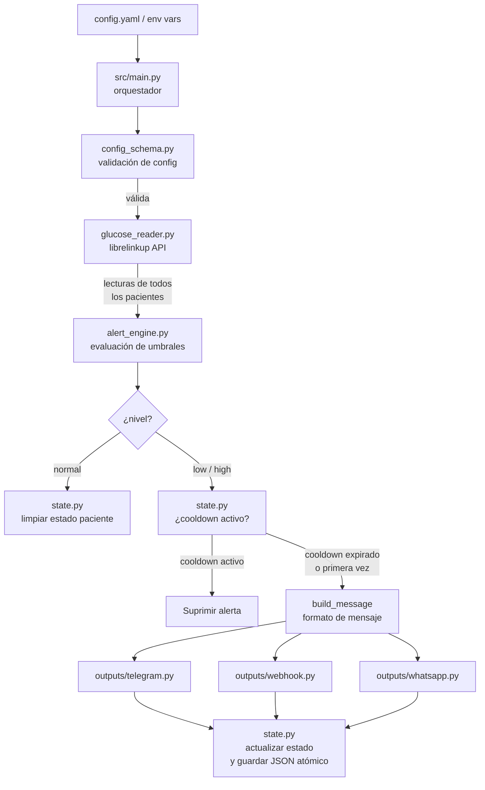

# 🏗️ Arquitectura del Sistema

## Diagrama de flujo



---

## Módulos y responsabilidades

### `src/main.py` — Orquestador principal

Punto de entrada del sistema. Responsabilidades:
- Cargar y validar `config.yaml`
- Configurar logging
- Adquirir file lock (evita ejecuciones concurrentes en modos con bucle de monitoreo: `daemon` y `full`)
- Ejecutar en modo `cron` (una sola vez), `daemon` (bucle con intervalo), `dashboard` (solo panel web) o `full` (dashboard + bucle)
- Orquestar el ciclo completo: lectura → evaluación → estado → envío → persistencia

### `src/api.py` — Dashboard web interno

Servidor FastAPI del panel de control. Responsabilidades:
- Servir la interfaz HTML/JS del dashboard
- Gestionar autenticación por cookie de sesión
- Hacer polling a LibreLinkUp en un hilo de segundo plano para mantener la caché en memoria
- Exponer endpoints protegidos: `/api/patients`, `/api/alerts`, `/api/health`
- Gestionar el flujo de configuración inicial (`/setup`) y login (`/login`)
- Se inicia automáticamente con `monitoring.mode: dashboard` o `full`

### `src/api_server.py` — API REST externa (solo lectura)

Servidor FastAPI ligero para consumo externo (widgets, apps móviles, watchfaces). Responsabilidades:
- Leer `readings_cache.json` que `src/main.py` actualiza en cada ciclo
- Exponer endpoints sin autenticación: `/api/readings`, `/api/health`, `/api/alerts`
- Configurar CORS para permitir acceso desde distintos orígenes
- Se inicia manualmente con `uvicorn src.api_server:app`

> **Distinción clave:** `src/api.py` es el backend del dashboard (auth requerida, datos en memoria). `src/api_server.py` es la API pública (sin auth, datos del archivo cache).

### `src/auth.py` — Gestión de sesiones y credenciales

Gestiona la autenticación del dashboard web. Responsabilidades:
- Verificar credenciales contra `config.yaml`
- Crear y validar tokens de sesión (almacenados en memoria, TTL de 24 horas)
- Detectar si el sistema ya ha sido configurado (`is_configured()`)

### `src/config_schema.py` — Validación de configuración

Valida el diccionario de configuración antes de ejecutar cualquier lógica. Devuelve una lista de errores claros, nunca lanza excepciones silenciosas.

### `src/glucose_reader.py` — Lector de glucosa

Se conecta a la API de LibreLinkUp usando `pylibrelinkup` y devuelve las lecturas de **todos** los pacientes vinculados a la cuenta. Normaliza el resultado en una lista de dicts con las claves: `patient_id`, `patient_name`, `value`, `timestamp`, `trend_arrow`.

### `src/alert_engine.py` — Motor de alertas

Lógica pura sin efectos secundarios:
- `evaluate(value, config)` → `"low"` / `"high"` / `"normal"`
- `is_stale(timestamp, max_age)` → detecta lecturas obsoletas
- `should_alert(level, state, cooldown)` → respeta el cooldown por paciente
- `build_message(...)` → formatea el mensaje con nombre de paciente y flecha de tendencia

### `src/state.py` — Persistencia de estado

Mantiene el estado de alertas por `patient_id` en un archivo JSON. Escritura atómica (`tempfile + os.replace`) para evitar corrupción si el proceso se interrumpe.

### `src/outputs/` — Salidas de alertas

Patrón Strategy con clase base abstracta `BaseOutput`. El módulo `src/outputs/__init__.py` expone `build_outputs(config)`, una función de fábrica que instancia todos los canales habilitados en la configuración.

| Clase | Descripción |
|-------|-------------|
| `TelegramOutput` | Envía mensajes via Telegram Bot API |
| `WebhookOutput` | HTTP POST compatible con Pushover |
| `WhatsAppOutput` | WhatsApp Cloud API (Meta) |

---

## Decisiones de diseño

### ¿Por qué iterar TODOS los pacientes?

LibreLinkUp permite vincular múltiples pacientes a una misma cuenta de cuidador (ej. madre e hijo con diabetes). La API devuelve una lista de conexiones. Iterar todos en lugar de usar solo `patients[0]` es la razón de ser del proyecto: monitoreo **familiar**.

### ¿Por qué estado por paciente?

El cooldown de alertas es independiente por paciente. Si Juan tiene una hiperglucemia y María una hipoglucemia al mismo tiempo, ambas alertas deben enviarse sin que el cooldown de una bloquee a la otra. El estado está keyed por `patient_id` (UUID de LibreLinkUp).

### ¿Por qué escritura atómica del estado?

Si el proceso se interrumpe (SIGKILL, error, fallo de disco) durante una escritura parcial de `state.json`, el archivo quedaría corrupto. La secuencia `tempfile → json.dump → os.replace` garantiza que el archivo siempre es un JSON válido o no existe; nunca un estado intermedio corrupto.

### ¿Por qué file locking con `fcntl`?

En modo `cron`, si un ciclo tarda más de 5 minutos (ej. LibreLinkUp lento), el siguiente cron job podría arrancar antes de que el anterior termine. El lock exclusivo (`LOCK_EX | LOCK_NB`) asegura que solo una instancia corra a la vez, evitando duplicación de alertas y condiciones de carrera en `state.json`.

---

## Cómo agregar un nuevo tipo de output (patrón Strategy)

1. Crea `src/outputs/mi_output.py`:

```python
from src.outputs.base import BaseOutput


class MiOutput(BaseOutput):
    def __init__(self, param1: str, param2: str) -> None:
        self.param1 = param1
        self.param2 = param2

    def send_alert(self, message: str, glucose_value: int, level: str) -> bool:
        # Implementa el envío aquí
        # Devuelve True si tuvo éxito, False en caso contrario
        ...
```

2. Registra el nuevo tipo en `src/outputs/__init__.py` dentro de `build_outputs()`:

```python
elif out_type == "mi_output":
    outputs.append(MiOutput(
        param1=out_cfg["param1"],
        param2=out_cfg["param2"],
    ))
```

3. Documenta el nuevo tipo en `config.example.yaml`:

```yaml
outputs:
  - type: mi_output
    enabled: false
    param1: ""
    param2: ""
```

4. Agrega tests en `tests/test_mi_output.py` siguiendo el patrón de `test_telegram_output.py`.
